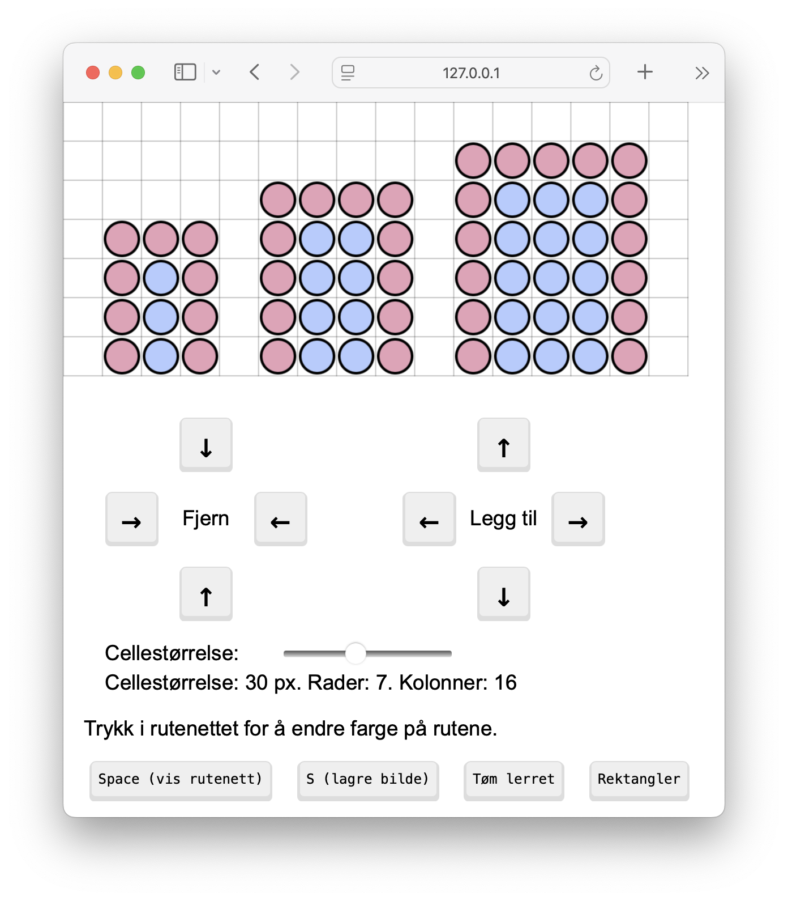

# Tegn figurtall

👉 [stalegjelsten.github.io/figurtall](https://stalegjelsten.github.io/figurtall) 👈

Tegn [figurtall](https://web01.usn.no/~panderse/MG1MA1/ArtikkelVP.pdf) ved hjelp av et rutenett.

- Trykk i rutenettet for å fargelegge en rute
  - Bruk <kbd>F</kbd> eller <button>Farge</button>-knappen for å endre fargen du fargelegger med
  - Du kan også holde nede <kbd>Q</kbd>, <kbd>W</kbd>, <kbd>E</kbd> eller <kbd>R</kbd> for å fargelegge med henholdsvis blått, grønt, rødt eller hvitt (visking).
- Trykk på knappene rundt «Forminsk lerret» og «Utvid lerret» for å fjerne og legge til rader og kolonner fra kantene av lerretet. Du kan også bruke piltastene.
  - <kbd>←</kbd><kbd>↑</kbd><kbd>→</kbd><kbd>↓</kbd> utvider lerretet med en rad eller kolonne i den angitte kanten.
  - <kbd>Shift ⬆︎</kbd> + <kbd>←</kbd><kbd>↑</kbd><kbd>→</kbd><kbd>↓</kbd> forminsker lerretet ved å ta bort en rad eller kolonne fra den angitte kanten.
- Trykk <kbd>Space</kbd> for å skjule rutenettet.
- Trykk på «Sirkler»-knappen for å endre formen på brikkene.
- Trykk <kbd>S</kbd> for å lagre bildet på datamaskinen.

For å legge til tekst under hver figur kan du for eksempel bruke et gratis online bilderedigeringsprogram som [Photopea](https://www.photopea.com/).

